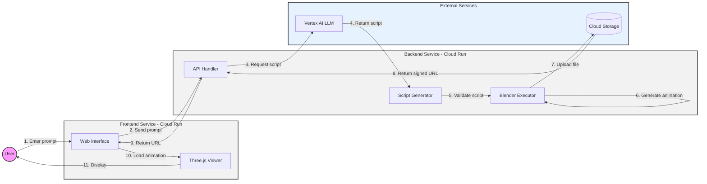

# Animation Generator

> **Note**: This demo is based on the [Securing Cloud Run services tutorial](https://cloud.google.com/run/docs/tutorials/secure-services) from the Google Cloud documentation.

## Architecture

* Frontend sends animation prompt to backend
* Backend validates prompt and calls LLM API
* Backend validates generated [Blender script](https://docs.blender.org/api/current/info_overview.html)
* Backend executes script in Blender
* Backend saves animation to GCS
* Backend returns GCS URL to frontend
* Frontend loads and displays animation

