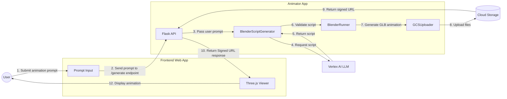

# Animation Generator

> **Note**: This demo is based on the [Securing Cloud Run services tutorial](https://cloud.google.com/run/docs/tutorials/secure-services) from the Google Cloud documentation.

## Architecture

The application processes animation requests through the following workflow:
1. Frontend sends animation prompt to backend
2. Backend validates prompt and calls LLM API
3. Backend validates generated [Blender script](https://docs.blender.org/api/current/info_overview.html)
4. Backend executes script in Blender
5. Backend saves animation to GCS
6. Backend returns GCS URL to frontend
7. Frontend loads and displays animation



The services communicate securely through Cloud Run's built-in service-to-service authentication.

## Prerequisites

- [Google Cloud SDK](https://cloud.google.com/sdk/docs/install)
- [Docker](https://docs.docker.com/get-docker/)
- [Terraform](https://developer.hashicorp.com/terraform/install)
- Active Google Cloud Project

## Setup Instructions

### 1. Set Environment Variables

```bash
# Set your project ID
export PROJECT_ID="<your-project-id>"
export REGION="us-central1"  # or your preferred region
export AR_REPO="animator-app"  # name for your Artifact Registry repository
```

### 2. Authenticate with Google Cloud

```bash
gcloud auth application-default login
```

### 3. Enable Required APIs

```bash
# Enable required Google Cloud APIs
gcloud services enable \
    artifactregistry.googleapis.com \
    cloudbuild.googleapis.com \
    run.googleapis.com \
    aiplatform.googleapis.com \
    storage.googleapis.com \
    apikeys.googleapis.com \
    generativelanguage.googleapis.com \
    secretmanager.googleapis.com \
    iam.googleapis.com
```

### 4. Create Artifact Registry Repository

```bash
# Create a Docker repository in Artifact Registry
gcloud artifacts repositories create $AR_REPO \
    --repository-format=docker \
    --location=$REGION \
    --description="Repository for Animation Generator"
```

### 5. Configure Docker Authentication

```bash
# Configure Docker to use gcloud as a credential helper
gcloud auth configure-docker ${REGION}-docker.pkg.dev
```

### 6. Build and Push Container Images

```bash
# Build frontend image
gcloud builds submit ./frontend \
    --tag ${REGION}-docker.pkg.dev/${PROJECT_ID}/${AR_REPO}/frontend:latest

# Build animator image
gcloud builds submit ./animator \
    --tag ${REGION}-docker.pkg.dev/${PROJECT_ID}/${AR_REPO}/animator:latest
```

### 7. Deploy to Cloud Run

Create a `terraform.tfvars` file in the terraform directory with your configuration:

```bash
# Navigate into the terraform/ directory
cd terraform

# Create terraform.tfvars file
cat << EOF > terraform.tfvars
project_id = "${PROJECT_ID}"
region = "${REGION}"
animator_container_image = "${REGION}-docker.pkg.dev/${PROJECT_ID}/${AR_REPO}/animator:latest"
frontend_container_image = "${REGION}-docker.pkg.dev/${PROJECT_ID}/${AR_REPO}/frontend:latest"
EOF

# Initialize terraform
terraform init

# Deploy cloud run services
terraform apply
```

## Clean Up

To avoid incurring charges, clean up the resources when no longer needed:

```bash
# Delete Cloud Run services
cd terraform
terraform destroy

# Delete Artifact Registry repository
gcloud artifacts repositories delete $AR_REPO \
    --location=$REGION
```