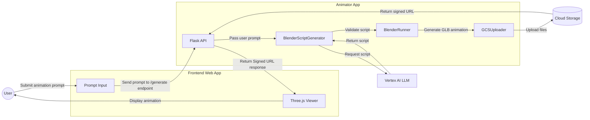

# Animation Generator

Containerized web application that generates animations based on user prompts using [Gemini 2.0](https://cloud.google.com/vertex-ai/generative-ai/docs/gemini-v2) (LLM) and [Blender](https://www.blender.org/).


> **Note**: This demo is based on the [Securing Cloud Run services tutorial](https://cloud.google.com/run/docs/tutorials/secure-services) from the Google Cloud documentation.

## Architecture

The application processes animation requests through the following workflow:

1. Frontend sends animation prompt to backend
2. Backend validates prompt and calls LLM API
3. Backend validates generated [Blender script](https://docs.blender.org/api/current/info_overview.html)
4. Backend executes script in Blender
5. Backend saves animation to GCS
6. Backend returns GCS URL to frontend
7. Frontend loads and displays animation



The services communicate securely through Cloud Run's built-in service-to-service authentication.

## Prerequisites

- [Google Cloud SDK](https://cloud.google.com/sdk/docs/install)
- [Docker](https://docs.docker.com/get-docker/) or [Podman](https://podman-desktop.io/downloads/)
- [Terraform](https://developer.hashicorp.com/terraform/install)
- [Docker Compose](https://docs.docker.com/compose/) or [Podman Compose](https://podman-desktop.io/docs/compose/setting-up-compose) for local development
- Active Google Cloud Project

## Cloud Deployment

### Setup Instructions

#### 1. Set Environment Variables

```bash
# Set your project ID
export PROJECT_ID="<your-project-id>"
export REGION="us-central1"  # or your preferred region
export AR_REPO="animator-app"  # name for your Artifact Registry repository
```

#### 2. Authenticate with Google Cloud

```bash
gcloud auth application-default login
```

#### 3. Enable Required APIs

```bash
# Enable required Google Cloud APIs
gcloud services enable \
    artifactregistry.googleapis.com \
    cloudbuild.googleapis.com \
    run.googleapis.com \
    aiplatform.googleapis.com \
    storage.googleapis.com \
    apikeys.googleapis.com \
    generativelanguage.googleapis.com \
    secretmanager.googleapis.com \
    iam.googleapis.com
```

#### 4. Create Artifact Registry Repository

```bash
# Create a Docker repository in Artifact Registry
gcloud artifacts repositories create $AR_REPO \
    --repository-format=docker \
    --location=$REGION \
    --description="Repository for Animation Generator"
```

#### 5. Configure Docker Authentication

```bash
# Configure Docker to use gcloud as a credential helper
gcloud auth configure-docker ${REGION}-docker.pkg.dev
```

#### 6. Build and Push Container Images

```bash
# Build frontend image
gcloud builds submit ./frontend \
    --tag ${REGION}-docker.pkg.dev/${PROJECT_ID}/${AR_REPO}/frontend:latest
# Build animator image
gcloud builds submit ./animator \
    --tag ${REGION}-docker.pkg.dev/${PROJECT_ID}/${AR_REPO}/animator:latest
```

#### 7. Deploy to Cloud Run

Create a `terraform.tfvars` file in the terraform directory with your configuration:

```bash
# Navigate into the terraform/ directory
cd terraform
# Create terraform.tfvars file
cat << EOF > terraform.tfvars
project_id = "${PROJECT_ID}"
region = "${REGION}"
animator_container_image = "${REGION}-docker.pkg.dev/${PROJECT_ID}/${AR_REPO}/animator:latest"
frontend_container_image = "${REGION}-docker.pkg.dev/${PROJECT_ID}/${AR_REPO}/frontend:latest"
EOF
# Initialize terraform
terraform init
# Deploy cloud run services
terraform apply
```

### Cleanup

To avoid incurring charges, clean up the resources when no longer needed:

```bash
# Delete Cloud Run services
cd terraform
terraform destroy
# Delete Artifact Registry repository
gcloud artifacts repositories delete $AR_REPO \
    --location=$REGION
```

## Local Development

Build and run the services locally using Docker Compose or Podman Compose for development and testing.

> **Note**: Steps create and save an [IAM service account key](https://cloud.google.com/iam/docs/service-account-creds#user-managed-keys) to a local JSON file.

### Setup

1. Set Environment Variables

   ```bash
   # Set your project ID
   export PROJECT_ID="<your-project-id>"
   export REGION="us-central1"  # or your preferred region
   ```

2. Authenticate with Google Cloud

   ```bash
   gcloud auth application-default login
   ```

3. Deploy infrastructure using Terraform

   ```bash
   cd terraform
   # Create terraform.tfvars file
   cat << EOF > terraform.tfvars
   project_id = "${PROJECT_ID}"
   region = "${REGION}"
   local_testing_mode = true
   EOF
   
   terraform init
   terraform apply  # enter yes to proceed
   cd ..
   ```

4. Set up the local environment

   ```bash
   ./setup-local-env.sh
   ```

5. Start the services locally

   ```bash
   # Using Docker Compose
   docker-compose up
   
   # Or using Podman Compose
   podman-compose up
   ```

6. Access the application at <http://localhost:3000>

### Local Cleanup

1. Press `Ctrl+C` to stop the containers
2. Delete GCP resources and service account key file provisioned in Terraform

```bash
cd terraform
terraform destroy
```
